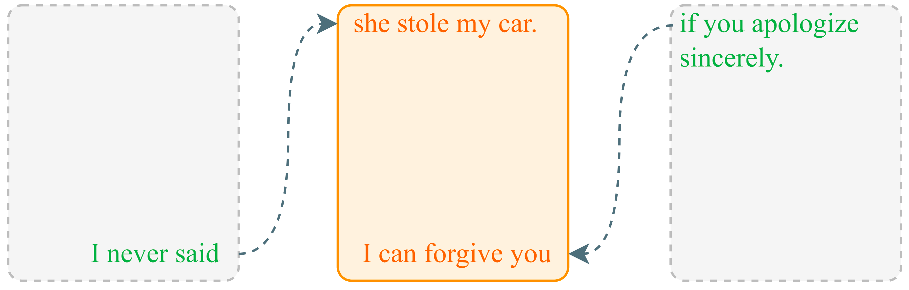
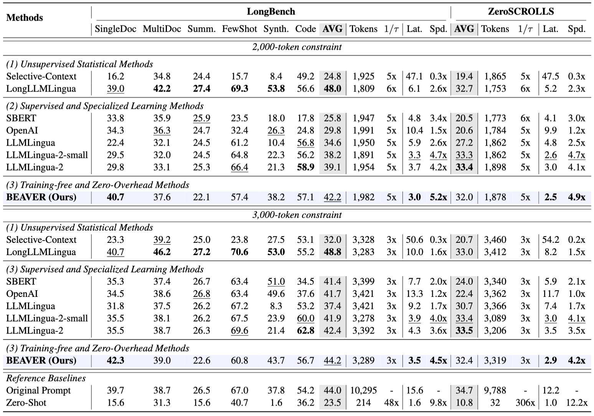
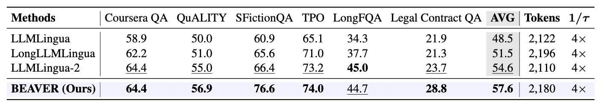
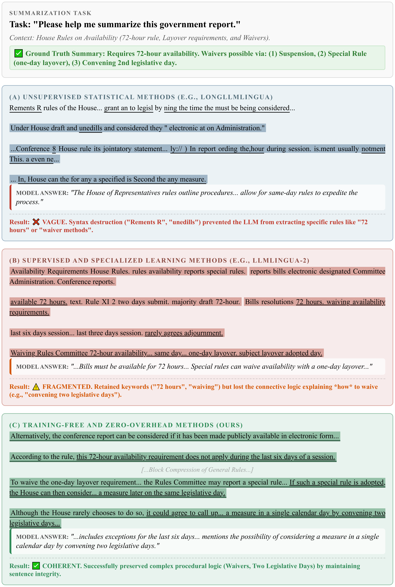

<p align="center">
  
</p>
<h3 align="center">BEAVER: Training-Free Hierarchical Prompt Compression via Structure-Aware Page Selection</h3>
<p align="center">
  <strong>Anonymous Author</strong><br>
  <a href="#">📜 Paper</a> | <a href="https://example.com/demo">🎬 Demo</a>
</p>
<p align="center">
  
  
</p>

> BEAVER is a training-free, structure-aware prompt compression framework that keeps discourse integrity while delivering extreme efficiency on long-context LLMs.

## 🧠 Method at a Glance

- **Comparison**: BEAVER targets structure-aware page selection instead of flat token pruning.

<p align="center">
  
</p>

- **Pipeline**: Segment text into page tensors, encode with dual-path pooling, plan queries with Anchor/Flow/Flash priors, then smooth to sentence boundaries.

<p align="center">
  
</p>

- **Sentence Smoother**: Restores syntactic coherence after selection.

<p align="center">
  
</p>

## 📜 Abstract
The exponential expansion of LLM context windows unlocks long-document understanding but introduces severe bottlenecks in latency and information utilization. Existing compression methods often suffer from high training costs or semantic fragmentation due to aggressive token pruning.  
We propose BEAVER, a training-free framework that shifts compression from linear token removal to structure-aware hierarchical selection. BEAVER maps variable-length contexts into dense page-level tensors to maximize hardware parallelism and preserves discourse integrity via a hybrid planner that combines dual-path pooling with sentence-level smoothing. On LongBench, ZeroSCROLLS, RULER, and L-Eval, BEAVER outperforms learning-based methods (e.g., LongLLMLingua) and achieves ~26× compression speedup on 128k contexts while maintaining high fidelity on multi-needle retrieval.

## 📊 Key Results

<p align="center">
  
</p>

<p align="center">
  
</p>

<p align="center">
  
</p>

<p align="center">
  
</p>

## 🎨 Task Visualizations

- **Few-shot reasoning**
<p align="center">
  
</p>

- **QA**
<p align="center">
  
</p>

- **Summarization**
<p align="center">
  
</p>

- **Code understanding**
<p align="center">
  
</p>

## 🧭 Overview
- **Segmenter**: maps variable-length text into 2D page tensors using natural delimiters, preserving local boundaries.
|- **PageEncoder**: training-free dual-path pooling merges global semantics with unsupervised In-Context ITF weighting.
- **QueryPlanner**: hybrid semantic–lexical scoring plus structural priors (Anchor, Flow, Flash) to pick valuable segments.
- **Sentence Smoother**: extends kept fragments to sentence boundaries to restore coherence after segmentation.

## 🔬 Experiment Details
- Benchmarks: LongBench, ZeroSCROLLS, RULER, L-Eval under 2k/3k token budgets.
- Backend LLM: gpt-3.5-turbo-instruct on NVIDIA A100.
- Baselines: LLMLingua series and embedding-based retrieval methods (see paper for hyperparameters).

## 🏆 Results
BEAVER surpasses SOTA baselines and dominates RULER multi-needle retrieval while delivering ~26× compression speedup on 128k contexts.

## 🚀 Quick Start (demo script)
Run the end-to-end compression + report pipeline using the provided script:
```bash
bash demo-test.sh
```
or:
```bash
python Demo.py \
  --model_path Qwen/Qwen3-8B \
  --in_jsonl ./QA.jsonl \
  --out_json ./QA_Result.json \
  --dtype bf16 \
  --page_size 64 \
  --anchor_pages 1 \
  --flow_window 1 \
  --flash_top_k 1

python Build_Html.py
echo 'All done. Visualization file is QA_Report.html'
```
Outputs:
- `QA_Result.json`: compression statistics and model generations.
- `QA_Report.html`: visualized kept spans for each sample.