<p align="center">
  
</p>
<h3 align="center">BEAVER: A Training-Free Hierarchical Prompt Compression Method via Structure-Aware Page Selection</h3>
<p align="center">
  <strong>Anonymous Author</strong><br>
  <a href="#">🎬 Demo</a>
</p>
<p align="center">
  
  
</p>

> BEAVER is a training-free, structure-aware prompt compression framework that preserves discourse integrity while delivering strong accuracy and million-token efficiency on long-context LLMs.

## 🧠 Method at a Glance

- **Comparison**: BEAVER targets structure-aware page selection instead of flat token pruning.

<p align="center">
  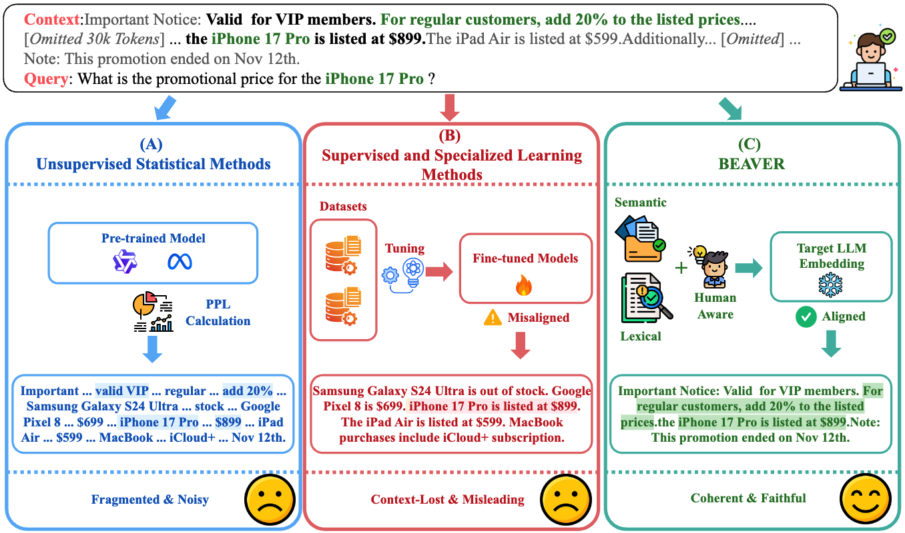
</p>

- **Pipeline**: Segment text into page tensors, encode with dual-path pooling, plan queries with Anchor/Flow/Flash priors, then smooth to sentence boundaries.

<p align="center">
  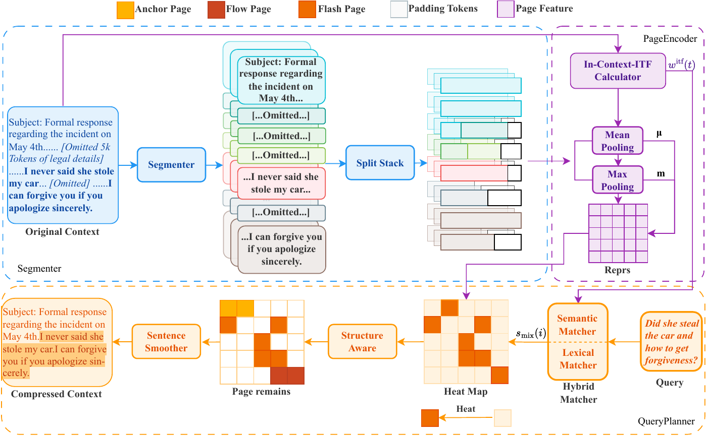
</p>

- **Sentence Smoother**: Restores syntactic coherence after selection.

<p align="center">
  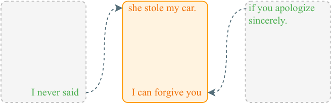
</p>

## 📜 Abstract
The exponential expansion of LLM context windows unlocks long-document understanding but introduces severe bottlenecks in latency and information utilization. Existing compression methods often suffer from high training costs or semantic fragmentation due to aggressive token pruning.  
We propose BEAVER, a training-free framework that requires no additional parameter updates and shifts compression from linear token removal to structure-aware hierarchical selection. BEAVER maps variable-length contexts into dense page-level tensors to maximize hardware parallelism and preserves discourse integrity via a hybrid planner that combines dual-path pooling with sentence-level smoothing. Across LongBench, ZeroSCROLLS, RULER, and L-Eval, BEAVER sets the strongest training-free results on LongBench and ZeroSCROLLS, establishes new training-free state of the art on RULER and L-Eval, and reaches 26.9x faster compression than LongLLMLingua at the 1M-token scale.

## 📊 Key Results

<p align="center">
  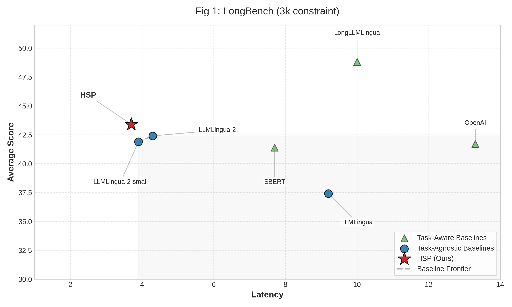
</p>

<p align="center">
  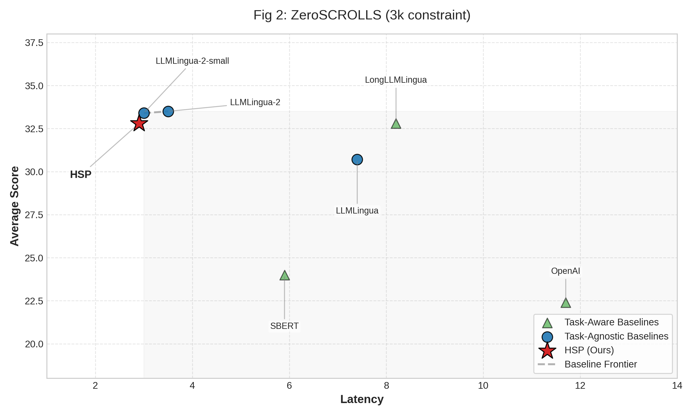
</p>

<p align="center">
  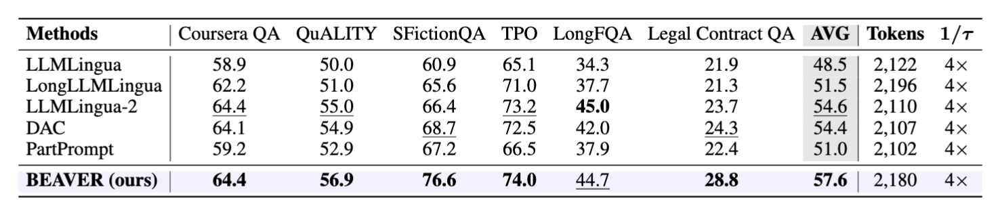
</p>

<p align="center">
  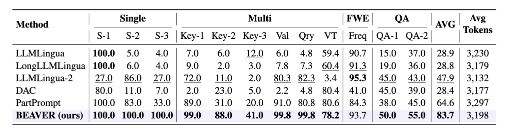
</p>

<p align="center">
  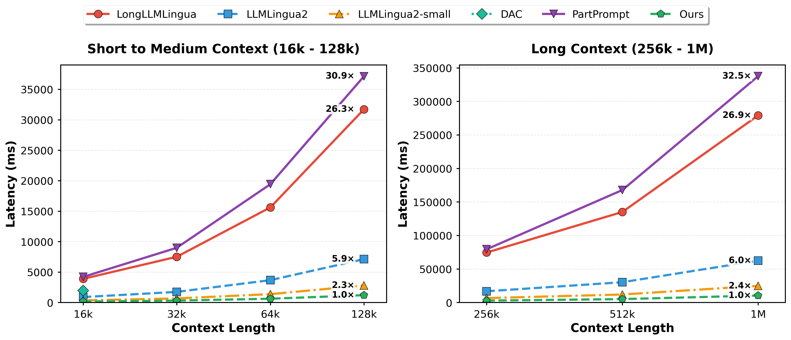
</p>

<p align="center">
  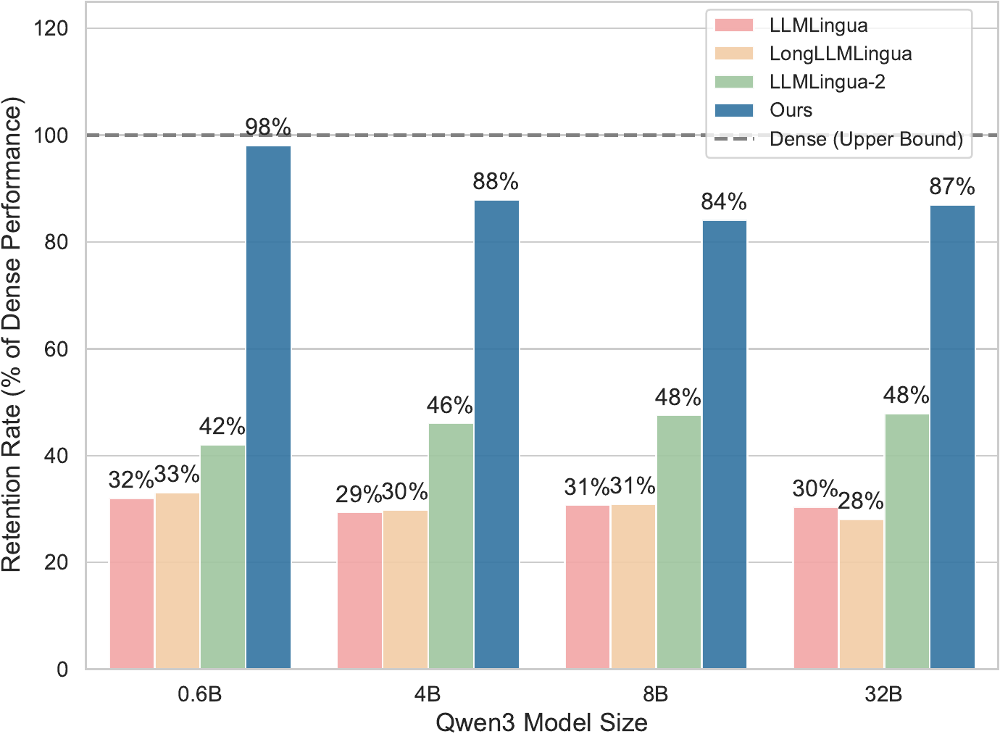
</p>

## 🎨 Task Visualizations

- **Few-shot reasoning**
<p align="center">
  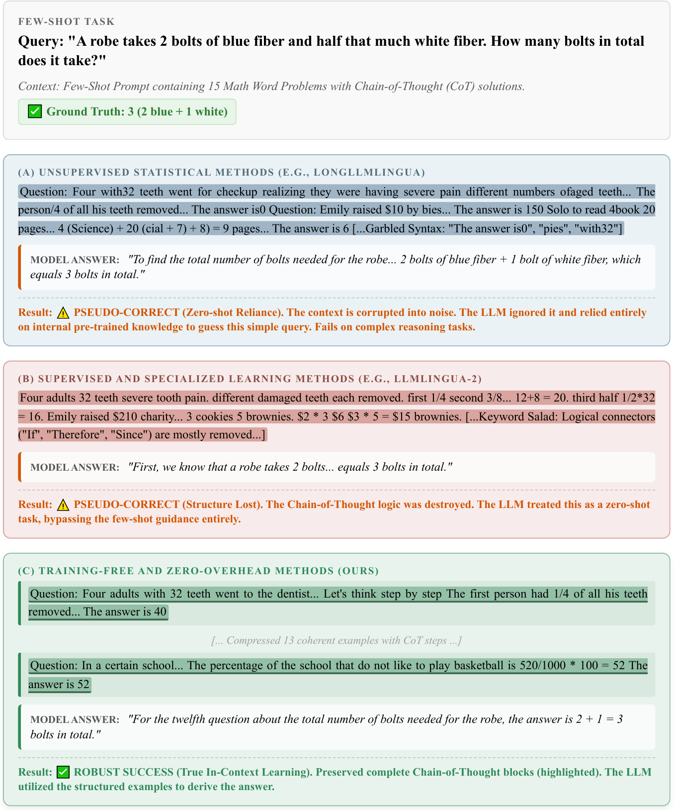
</p>

- **Financial QA**
<p align="center">
  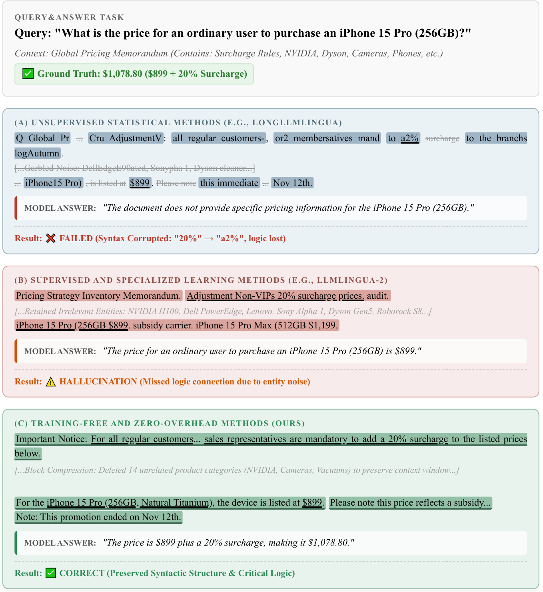
</p>

- **GovReport**
<p align="center">
  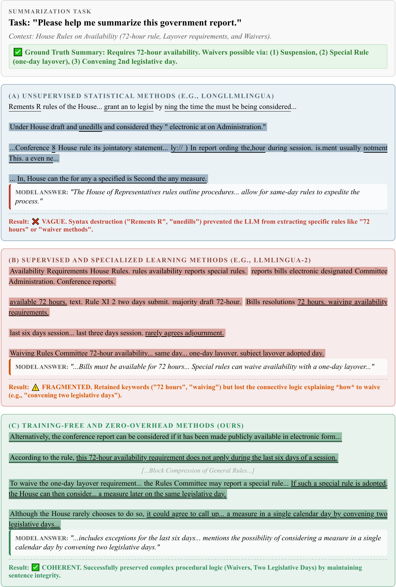
</p>

- **Code understanding**
<p align="center">
  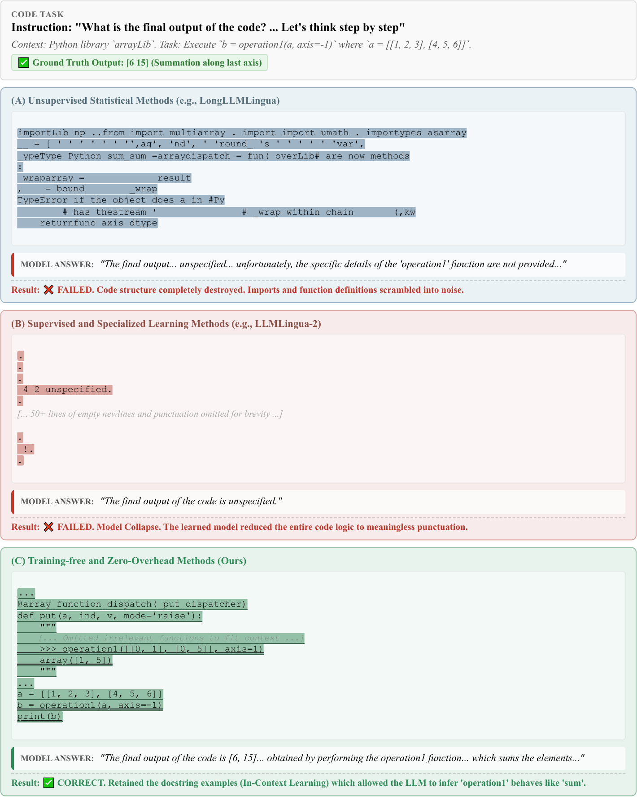
</p>

## 🧭 Overview
- **Segmenter**: maps variable-length text into 2D page tensors using natural delimiters, preserving local boundaries.
- **PageEncoder**: reuses the target model's embedding table with dual-path pooling to capture global semantics and salient local cues.
- **QueryPlanner**: hybrid semantic-lexical scoring plus structural priors (Anchor, Flow, Flash) to pick valuable pages.
- **Sentence Smoother**: extends kept fragments to sentence boundaries to restore coherence after segmentation.

## 🔬 Experiment Details
- Benchmarks: LongBench, ZeroSCROLLS, RULER, L-Eval under 2k/3k token budgets.
- Backend LLMs: gpt-3.5-turbo-instruct for LongBench/ZeroSCROLLS/L-Eval and Qwen3-8B for RULER.
- Baselines: LLMLingua series, DAC, PartPrompt, and embedding-based retrieval methods.

## 🏆 Results
BEAVER leads the training-free baselines on LongBench, ZeroSCROLLS, RULER, and L-Eval while delivering 26.9x faster compression at the 1M-token scale.

## 🚀 Quick Start (demo script)
Run the end-to-end compression + report pipeline using the provided script:
```bash
bash demo-test.sh
```
or:
```bash
python Demo.py \
  --model_path Qwen/Qwen3-8B \
  --in_jsonl ./QA.jsonl \
  --out_json ./QA_Result.json \
  --dtype bf16 \
  --page_size 64 \
  --anchor_pages 1 \
  --flow_window 1 \
  --flash_top_k 1

python Build_Html.py
echo 'All done. Visualization file is QA_Report.html'
```
Outputs:
- `QA_Result.json`: compression statistics and model generations.
- `QA_Report.html`: visualized kept spans for each sample.
